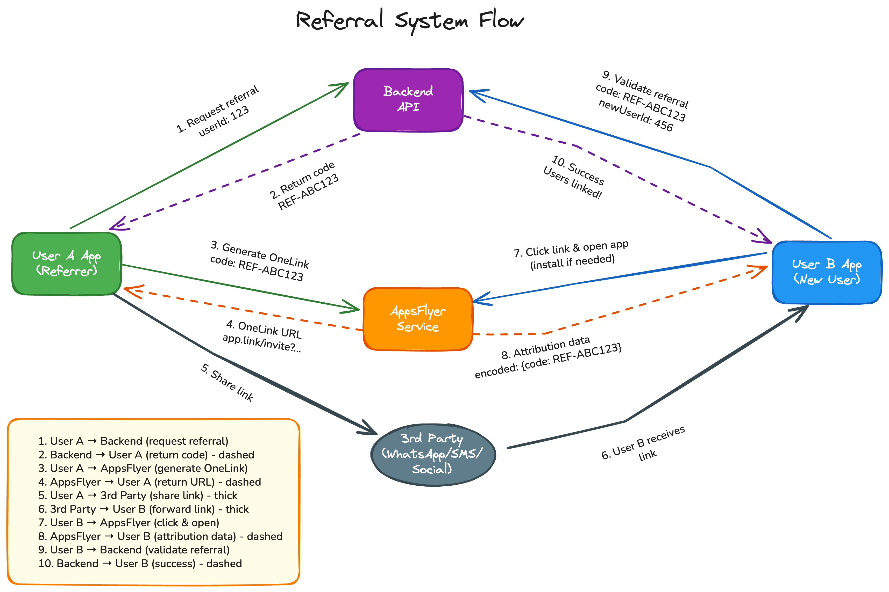

Since we are building this mechanism from scratch, tool and library choices may depend on team preferences and tech stack familiarity—something I would normally discuss with the team before implementation.

For the purposes of this task, I propose using **AppsFlyer** for deep link generation and user attribution. It is a robust and widely adopted solution for mobile marketing analytics, and I’ve successfully used it in past projects.

We’ll utilize AppsFlyer’s **OneLink** feature to generate dynamic invitation links that carry referral attribution data across installations and sessions.

I believe this approach is efficient enough and avoids excessive overengineering. While it's possible to design for every edge case, attempting to catch the last 0.5% of dropped referrals can introduce unnecessary complexity. That said, this trade-off is always open for discussion depending on business priorities.
## System Design Diagram (ideal case)

## Deep Linking & Attribution Strategy

Let’s walk through an example with two users: John (referrer) and Tom (invitee).

### Step 1: John Generates a Referral Link
1. John taps a “Share Invite” button in his app.
2. The app requests a unique referral code from our backend. This code uniquely identifies John. Creation/Expiration other attribution.
3. Using this code, the app asks AppsFlyer to generate a OneLink, embedding the referral code as a parameter.
4. John shares the link via any 3rd-party service (SMS, WhatsApp, social media, etc.).

### Step 2: Tom Clicks the Link

#### Case A: Tom doesn’t have the app installed
- The OneLink redirects Tom to the appropriate app store (iOS or Android).
- After installation and on first app launch:
    - AppsFlyer SDK initializes and retrieves deferred deep link data.
    - The referral code is extracted from the AppsFlyer attribution payload.
    - The app sends the code to our backend to establish a referrer–referee relationship.
    - The backend validates and stores the link between John and Tom, possibly awarding incentives.

#### Case B: Tom already has the app installed
- OneLink opens the app directly using a universal link.
- AppsFlyer SDK retrieves deep link data immediately.
- The app extracts the referral code from the launch context.
- If Tom hasn’t signed up yet, the app temporarily stores the referral code locally.
- Once Tom signs up or logs in, the app sends the code to the backend for referral processing.
- The backend may reject the referral if Tom is already an active or returning user.

---  

## Secure and Reliable Referral Tracking

- Referral codes are generated server-side and are uniquely associated with each user.
- AppsFlyer SDK handles deep link data securely
- The app will persist referral data locally (encrypted storage) until it’s confirmed and sent to the backend after login.

---  

## Fallbacks and Trade-offs

While AppsFlyer provides a reliable solution, attribution might still fail under certain circumstances (e.g., network issues, user clears cache, SDK initialization errors, etc.). In such cases, we can implement the following fallbacks:

- **Fallback URL with explicit in-app flow:** OneLink can include a fallback web URL that opens a custom landing screen inside the app. If attribution fails, we can guide the user through a manual flow where they can enter the referrer’s code manually.
- **Display referral code as plain text:** When generating the share link, we can include the referral code as plain text in the message body. For example:    
  `"Join me on this app! Use my code JOHN123 or tap the link: [OneLink URL]"` (I am not sure how good it is yet, but want to include)
- **Analytics and Monitoring:** We’ll track failed attributions and monitor them through backend logs and AppsFlyer dashboards.

